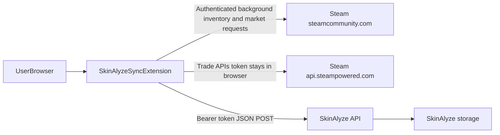

# Data flow (SkinAlyze Sync)

High-level view of where data moves. This matches the implementation in `src/` (see [backend-contract.md](./backend-contract.md) for HTTP details).

## Legend

- **Steam pages**: the extension fetches inventory-related JSON/HTML endpoints using your existing Steam login. Nothing in this repo uploads raw Steam HTML to SkinAlyze.
- **Browser visibility**: automatic Steam work uses the Chrome service worker/offscreen parser or the Firefox background document. Only an explicit manual action may use a temporary inactive Steam tab as a fallback, and that tab is closed after the read.
- **Steam Web API**: optional trade sync uses session-derived tokens **inside the browser** to query Steam’s API hosts.
- **SkinAlyze API**: normalized payloads only, authenticated with the SkinAlyze-issued bearer token after pairing.
